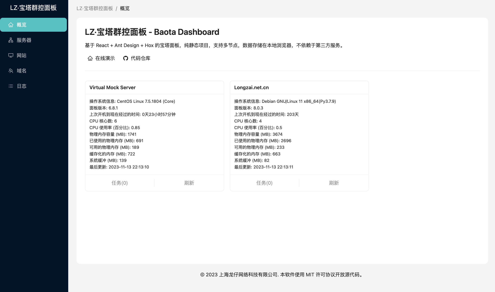

# Baota Dashboard

基于 React + Ant Design + Hox 的宝塔面板，纯静态项目，支持多节点，数据存储在本地浏览器，不依赖于第三方服务。

## 界面预览



## 常见问题

### 跨域请求

浏览器若错误提示，需要允许跨域请求。

```
Access to XMLHttpRequest has been blocked by CORS policy: No 'Access-Control-Allow-Origin' header is present on the requested resource.
```

请在服务器端增加跨域配置。

```nginx
    location ^~ / {
        # ... (existing configuration)

        if ($request_method = 'OPTIONS') {
            add_header 'Access-Control-Allow-Origin' '*';

            add_header 'Access-Control-Allow-Credentials' 'true';
            add_header 'Access-Control-Allow-Methods' 'GET, POST, OPTIONS';

            add_header 'Access-Control-Allow-Headers' 'DNT,X-CustomHeader,Keep-Alive,User-Agent,X-Requested-With,If-Modified-Since,Cache-Control,Content-Type';

            add_header 'Access-Control-Max-Age' 86400;
            add_header 'Content-Type' 'text/plain charset=UTF-8';
            add_header 'Content-Length' 0;
            return 204; break;
        }

        if ($request_method = 'POST') {
            add_header 'Access-Control-Allow-Origin' '*';
            add_header 'Access-Control-Allow-Credentials' 'true';
            add_header 'Access-Control-Allow-Methods' 'GET, POST, OPTIONS';
            add_header 'Access-Control-Allow-Headers' 'DNT,X-CustomHeader,Keep-Alive,User-Agent,X-Requested-With,If-Modified-Since,Cache-Control,Content-Type';
        }
        if ($request_method = 'GET') {
            add_header 'Access-Control-Allow-Origin' '*';
            add_header 'Access-Control-Allow-Credentials' 'true';
            add_header 'Access-Control-Allow-Methods' 'GET, POST, OPTIONS';
            add_header 'Access-Control-Allow-Headers' 'DNT,X-CustomHeader,Keep-Alive,User-Agent,X-Requested-With,If-Modified-Since,Cache-Control,Content-Type';
        }
    }

```

如果你的BT面板添加 Access-Control-Allow-Headers 失败，也可以考虑采用 反向代理进行请求转发。

### IP校验失败

若出现错误提示，请将 127.0.0.1 添加到IP白名单。

```
IP校验失败,您的访问IP为[127.0.0.1]
```

## 参考资料

- [宝塔 Linux 面板 API 文档](https://www.bt.cn/api-doc.pdf)
- [面板 API 密钥获取教程](https://www.bt.cn/bbs/thread-113890-1-1.html)
- [API 接口使用教程](https://www.bt.cn/bbs/thread-20376-1-1.html)
